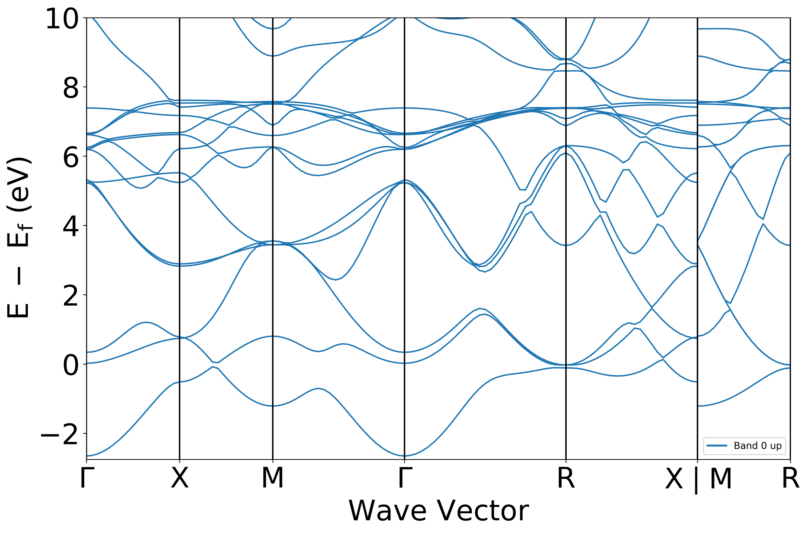

---
title: VASP Inputs
nav_order: 2
has_children: false
---

## VASP inputs

### Linear algebra woes

VASP is a plane-wave basis set DFT code, which means that it turns a complicated differential equation problem into linear algebra:
$$
h(\boldsymbol{k} + \boldsymbol{g},\boldsymbol{k} + \boldsymbol{g'}) \phi_{n\boldsymbol{k}} = \varepsilon_{n\boldsymbol{k}}\phi_{n\boldsymbol{k}}.
$$
In this equation, $h$ is a matrix which depends on a wavevector or "*k*-point" $\boldsymbol{k}$ and the reciprocal lattice vectors $\boldsymbol{g}$, which are defined by the crystal system.
The eigenvectors of the Hamiltonian matrix $h$ are $\phi_{n\boldsymbol{k}}$, and its eigenvalues are $\varepsilon_{n\boldsymbol{k}}$.

In principle $h$ is just a regular old "rank-2" matrix which has rows and columns, but both are infinitely long.

The *k*-points are basically grid points in reciprocal space (the Fourier basis set), so the accuracy of our calculation increases by increasing the density or number of *k*-points we use in a calculation.

That also means that we have to solve this equation **for every *k*-point** we use in the calculation.

Similarly, there is a fundamental theorem in linear algebra that tells us that an $N\times N$ matrix has at most $N$ distinct eigenvalues, which we label here by $n$.
That means that there are probably **countably infinite** eigenvalues and eigenvectors of this matrix, **for every *k*-point**.

It turns out that for ground state calculations, we don't need to calculate infinitely many of these eigen-vectors/values.
Typically, we make an approximation that the kinetic energy of the electrons, which is roughly
$$
\frac{\hbar^2}{2m_e}|\boldsymbol{k}+\boldsymbol{g}|^2 < E_\mathrm{cut}
$$
is less than a tolerance, called the **cutoff energy** $E_\mathrm{cut}$.
This is great, because it reduces this to a problem which is readily solvable by standard math libraries that have been developed over the years (BLAS, LLAPACK, etc.).

Physically, the eigenvalues are just the bandstructure as a function of the $\boldsymbol{k}$-point and the band index $n$:
